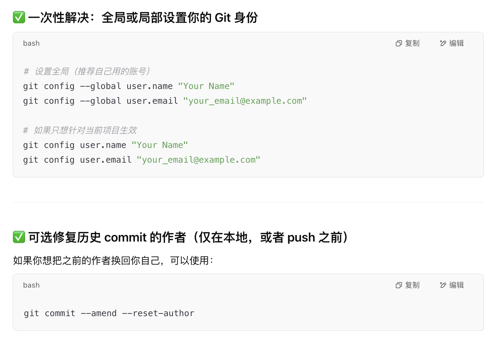

## Python tips: 

### 4. python_env: as a way to isolate the env.
```bash
vim ~/.bashrc
alias python_env="PYTHONPATH=/home/ani/policy_env/lib/python3.10/site-packages:$PYTHONPATH /home/ani/policy_env/bin/python"
```
```python
python_env scripts.py
```

### 3. tmux
```python
tmux new -s bert_bin -d "python main.py --model bert --binary --epochs 3"
tmux new -s bert_ag  -d "python main.py --model bert --epochs 2"
tmux new -s gru_bin  -d "python main.py --model gru --binary --epochs 6"
tmux new -s gru_ag   -d "python main.py --model gru --epochs 8"

tmux ls
tmux attach -t bert_bin
tmux kill-session -t bert_bin
```

### 2. Reinforce updating to a new version regardless of the outside
```python
source /home/ani/policy_env/bin/activate
pip install --upgrade pip
pip install --upgrade --force-reinstall --no-cache-dir plotly
```

### 1. Clean sys path:
```python
import sys
sys.path = [p for p in sys.path if "isaac-sim" not in p]
```

---

## Other Notes:


### Solve the problem of github account name error

```bash
# global
git config --global user.name "Your Name"
git config --global user.email "your_email@example.com"

# local 
git config user.name "Your Name"
git config user.email "your_email@example.com"

git commit --amend --reset-author
```




### Can't find device for rendering
Update and change nvidia driver to solve it. 


### linux ln modulefinder.py to env
```python
ln -s /home/ani/.local/share/ov/pkg/isaac-sim-4.2.0/kit/python/lib/python3.10/modulefinder.py \
      /home/ani/isaac_env/lib/python3.10/modulefinder.py
```

### Create ssh key:
```sh
ls -al ~/.ssh
```
```sh
ssh-keygen -t ed25519 -C "yichatma@gmail.com"
```
```sh
cat ~/.ssh/id_ed25519.pub
```

### Test ssh connection
```sh
ssh -T git@github.com
```

### Check if the key is sent successfully to ssh Agent
```sh
# launch SSH agent
eval "$(ssh-agent -s)"

# Add ED25519 private key to agent
ssh-add ~/.ssh/id_ed25519
```

```sh
ssh -vT git@github.com
```

### github upload files larger than 100mb
```sh
# use Git LFS
sudo apt-get install git-lfs
```
```sh
git lfs install
git lfs track "*.zip"
git add .gitattributes
git add path/to/your/largefile.zip
git commit -m "Add large file with Git LFS"
git push origin main
```

### fishros
```sh
wget http://fishros.com/install -O fishros && . fishros
```

### Error: ./license_checker: error while loading shared libraries: libcrypto.so.1.1: cannot open shared object file: No such file or directory
 ```sh
ldd ./license_checker
```
make sure the openssl version is right
```sh
wget https://www.openssl.org/source/openssl-1.1.1u.tar.gz
tar -xzf openssl-1.1.1u.tar.gz
cd openssl-1.1.1u
./config
make
sudo make install
# check
/usr/local/bin/openssl version
```
Don't forget to check the symbolic link.
**This can be found in asking history of chatgpt.**


### The path to put .vscode for Isaac
```sh
[INFO] Setting up vscode settings...
[WARN] Could not find Isaac Sim VSCode settings: /home/ani/anaconda3/envs/any_isaac/lib/python3.10/site-packages/isaacsim/.vscode/settings.json.
	This will result in missing 'python.analysis.extraPaths' in the VSCode
	settings, which limits the functionality of the Python language server.
	However, it does not affect the functionality of the Isaac Lab project.
	We are working on a fix for this issue with the Isaac Sim team.
```

### Disable Auto-Activation of the Base Environment
```sh
conda config --set auto_activate_base false
```
----

```sh
export ROS_PACKAGE_PATH=$ROS_PACKAGE_PATH:~/ur_grasp_driver/yc_ws/install/my_ur_driver/share
```

